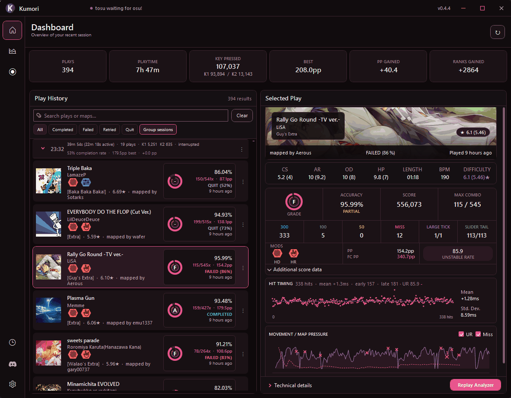
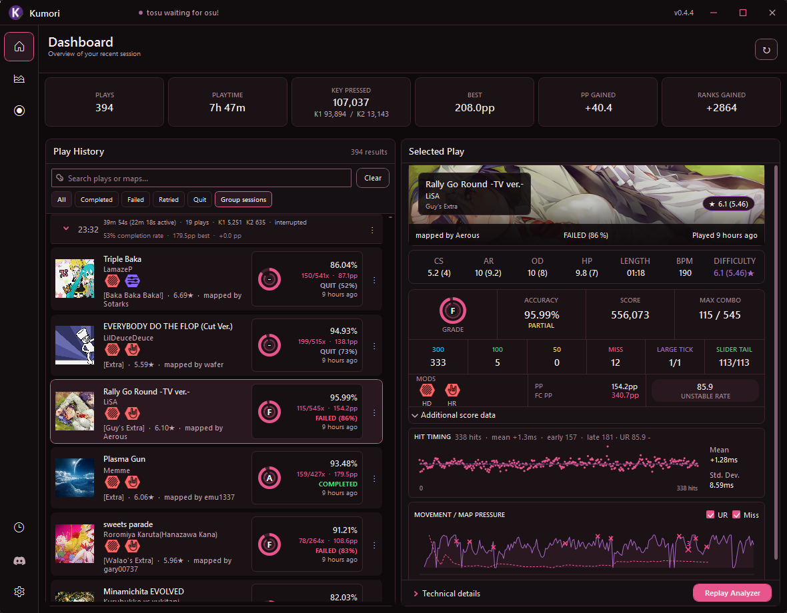
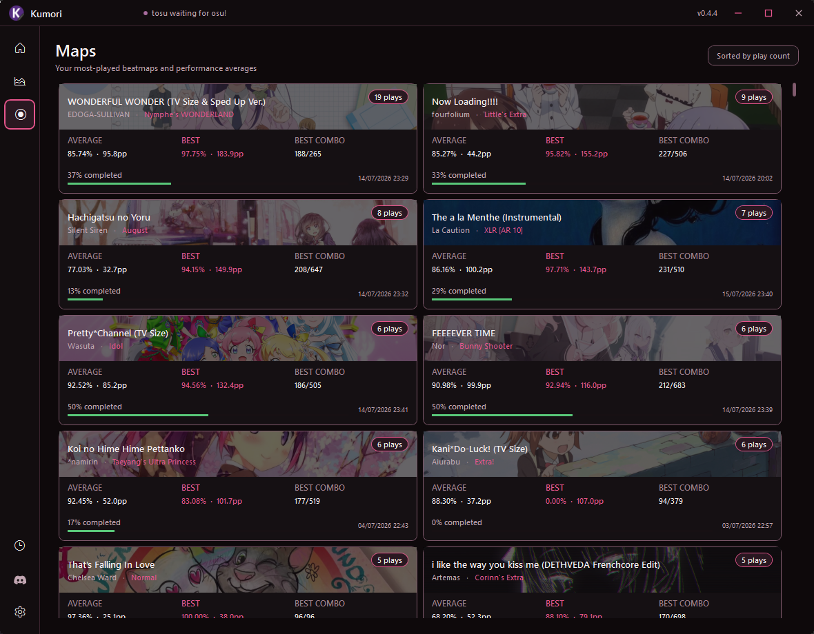
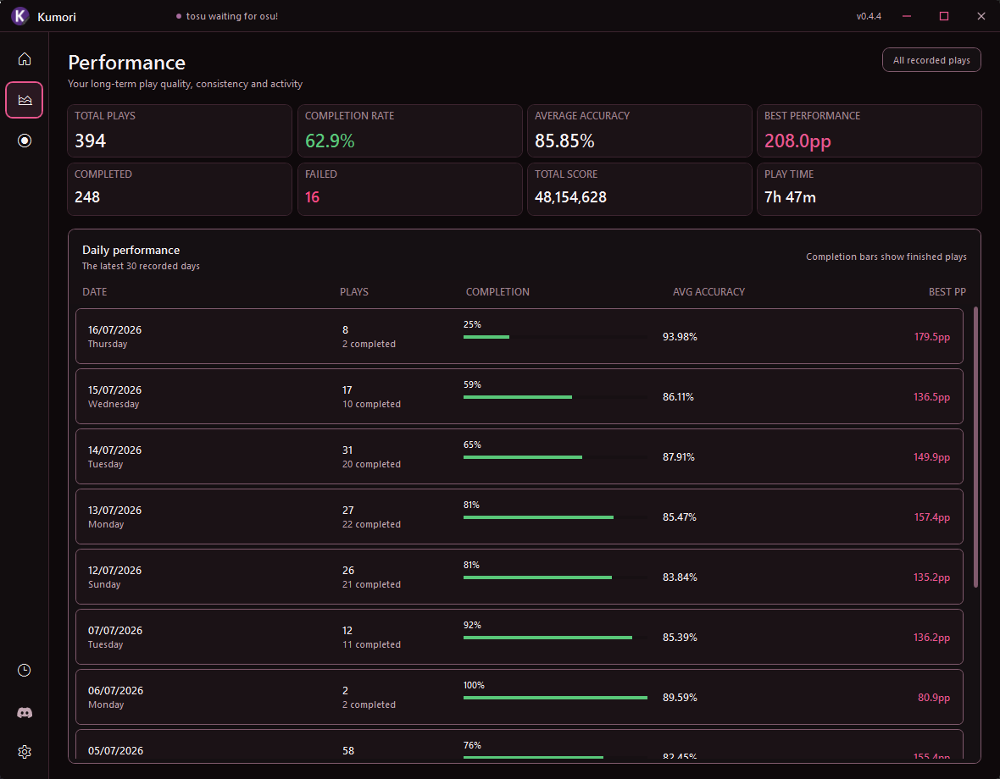
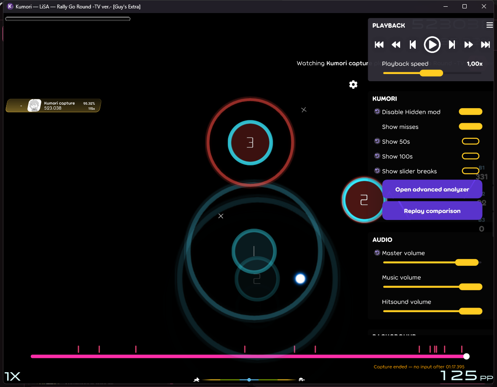
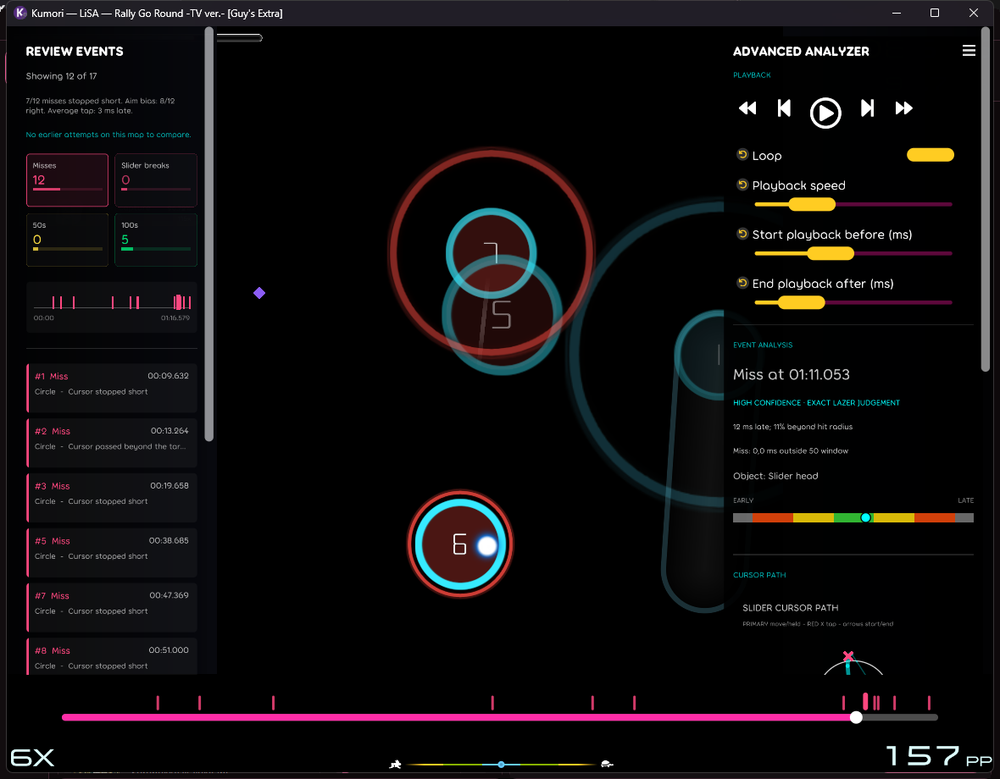

# Kumori

Kumori is a Windows companion for [osu!](https://osu.ppy.sh/) that keeps your play history, sessions, map statistics, performance trends, and replay analysis together in one place.



Kumori works with both osu!stable and osu!lazer. It does not change your osu! installation, and your play history stays on your computer.

## What can Kumori do?

- **Remember every play.** See the map, score, accuracy, combo, misses, mods, performance points, and when you played.
- **Organize your sessions.** Kumori groups plays together so you can review an entire practice session at a glance.
- **Show your progress.** Follow your play count, completion rate, average accuracy, best performance, total play time, and daily activity.
- **Find your favorite maps.** Browse maps by how often you play them and compare your average and best results.
- **Help explain mistakes.** The optional Replay Analyzer lets you revisit difficult moments, move through a replay, and inspect timing and cursor movement.
- **Stay out of the way.** Kumori can start with Windows and keep running quietly in the system tray while you play.

## Your session at a glance

The Dashboard combines your recent plays with a detailed view of the selected result. Search your history, filter by outcome, group plays into sessions, and jump into replay analysis when capture data is available.



## See the bigger picture

The Maps page highlights the beatmaps you return to most and compares completion, accuracy, performance, and combo results. The Performance page summarizes your overall results and recent daily consistency.





## Getting started

1. Open the [latest Kumori release](https://github.com/Lorenso0/Kumori/releases/latest).
2. Download `Kumori.exe`.
3. Run the app and follow the short setup guide.
4. Start osu! and play as usual. Kumori will begin building your history.

Kumori is made for 64-bit Windows. During setup, you can choose whether to enable replay capture and optional extras. These choices can be changed later in Settings.

## Replay Analyzer

When replay capture is enabled, Kumori can open a play in its built-in Replay Analyzer. You can:



- Jump directly to misses, slider breaks, 50s, and 100s.
- Slow down playback, step through frames, or loop a difficult moment.
- Review timing and cursor movement around a mistake.
- Compare compatible attempts on the same map or temporarily load a matching `.osr` replay.
- Import an osu! skin for use in the replay viewer.

The advanced analyzer focuses the replay on review events. Its event browser and timeline work alongside loop and frame controls, confidence-tagged timing evidence, and cursor-path analysis.



The analyzer explains what the captured information suggests, but it cannot always know the exact reason for a mistake. Results may be less precise when a replay capture is incomplete. Replay capture for osu! is experimental and may need updates when the game changes.

## Skin Extras library

The Skin Editor can extract reusable element families from an installed osu!lazer
skin, a stable skin folder, or an `.osk` archive. The Extras library groups
packs by gameplay area and family, including cursors, hit objects, sliders,
number fonts, judgements, HUD/interface elements, spinners, menu assets,
hitsound sample sets, combobreak, and other gameplay audio. Catch, Taiko, and
Mania groups stay hidden unless they are enabled in Settings.

The **Lazer-used only** filter is enabled by default in both the library and
the extraction review. It is audited against official osu! `2026.702.0`
(`b7774fe8d16a96690bef65b4f9562e3df393d5e4`) and classifies individual files,
not whole folders. It controls previews, extraction, and application; applying
a filtered mixed pack cannot replace or delete stable-only target assets.
Turning it off restores every stored file and labels incompatible files as
**Stable only** or **Unverified**. The physical pack, fingerprint, names, tags,
favorites, and history are never rewritten by filtering.

Extracted packs use the display name `<Skin name> — <Author>`. On disk they are
stored as `<Area>\<Family>\<Variant>\<Pack name>`; `Variant` is omitted when it
does not apply. Invalid Windows filename characters are replaced, reserved
device names are prefixed with `_`, and a short fingerprint suffix is added
only when a different pack would otherwise use the same folder.

Each pack has an `extras.json` manifest that records its family, logical files,
content fingerprints, and only the `skin.ini` values owned by that family.
Number-font packs always carry their prefix and overlap settings so custom
hitcircle, score, and combo digits work after mixing. Repeated Mania sections
are addressed by key count. Identity fields such as the skin name and author
are never copied into another skin.

The library blocks exact pack duplicates before extraction, stores identical
file bytes once in its internal object store, and fingerprints images plus WAV,
MP3, and OGG audio by decoded content where supported. Search, tags, favorites,
recently used ordering, pack health checks, repair, and portable `.kextra`
import/export are available from the Extras window. The library name can be
chosen during extraction or import and changed later with **Rename…** without
changing the pack's duplicate identity, tags, or favorites.

Extras packs are staged by logical element rather than as an all-or-nothing
skin replacement. Individual layers can be checked, unchecked, or isolated;
animation frames and matching 1x/2x files stay together. **Compare** previews
the current family beside the exact mixed result, including preserved
current-skin layers and earlier staged changes, before the selected elements are
added to Changes. Cursor packs never import `cursormiddle` assets; the optional
**Smooth Trail** setting instead stages a transparent 1x1 `cursormiddle.png`
placeholder and removes every other cursor-middle variant.

The Skin Editor also maintains a complete local copy of the signed public
[Kumori Extras catalog](https://github.com/Lorenso0/Kumori-Extras). Opening
the editor starts a non-blocking conditional update check, and **Check for
updates** is available from both the Actions menu and Extras header. New,
updated, missing, or unhealthy catalog packs are always transferred as complete
`.kextra` archives inside two verified catalog bundles. Each changed bundle is
downloaded once and supplies every complete pack it contains; healthy unchanged
bundles and packs are skipped. Failed or offline
checks leave the installed library usable. Revisions are staged and verified
before atomically replacing the active pack, with three local recovery backups.
Withdrawn catalog packs remain installed and are labeled instead of deleted.

## Your data stays yours

Kumori stores its settings, history, replay data, skins, backups, and logs locally in:

`%APPDATA%\Kumori\`

Kumori does **not** upload your play history. It uses the internet to check for
application and Extras catalog updates, download its local tracking helper, and
fetch optional beatmap artwork and map files.

Automatic backups are enabled by default and can be managed in Settings. For protection against a failed or lost drive, copy important backups somewhere else too.

## How tracking works

Kumori uses [tosu](https://github.com/tosuapp/tosu), a small helper that reads live osu! information on your own computer. Kumori can install, update, start, and stop its managed copy automatically. The connection remains local to your PC at `127.0.0.1:24051`.

Some play details are only available when Kumori was running and able to capture them. Older plays may therefore contain less information than newer ones.

## Optional extras

Kumori can also manage a few convenience features from Settings:

- Start automatically when you sign in to Windows, optionally minimized to the system tray.
- Run OpenTabletDriver while Kumori is open.
- Switch supported LG monitors into Dual Mode when osu! starts, then restore them afterward.
- Check tracking, storage, backups, and companion services from the maintenance tools.
- Create a problem-report file when you need help.

OpenTabletDriver and LG Dual Mode support are optional. LG Dual Mode only works with compatible monitors and setups.

## Building from source

This section is for developers. On Windows, install the [.NET 10 SDK](https://dotnet.microsoft.com/download/dotnet/10.0), clone the repository, and run one of these commands from the repository folder:

The build script obtains the official osu! `2026.726.0-lazer` source at its
exact release commit under the ignored `third_party\osu` directory. This
source pin is used because matching `ppy.osu.Game` NuGet packages have not
been published for that release.

```bat
build-app.cmd
```

Build and launch Kumori without running tests:

```bat
run.bat
```

`run.bat` launches an unchanged Debug build immediately. When source files
change, it rebuilds only affected projects and their dependants. Use
`run.bat rebuild` when you explicitly need to rebuild the complete development
graph. The command window stays attached while Kumori is running and returns to
the prompt when the app closes.

For a quick developer build without test and utility projects:

```bat
dotnet build Kumori.Dev.slnf
```

Create a self-contained release at `dist\app\Kumori.exe`:

```bat
build-app.cmd publish
```

Compatibility with the custom BPM Adjust client is tracked against a specific
upstream commit in [docs/BPM_ADJUST_UPSTREAM.md](docs/BPM_ADJUST_UPSTREAM.md).

## Project note

Kumori is an independent project and is not affiliated with, endorsed by, or supported by ppy Pty Ltd, osu!, or tosu.

Third-party components keep their own licenses. See [THIRD-PARTY-NOTICES.md](THIRD-PARTY-NOTICES.md) for details.
